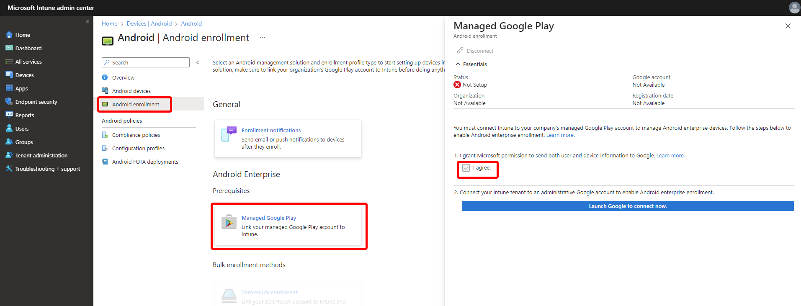

---
# required metadata

title: Connect your Intune account to your Managed Google Play account.
titleSuffix: Microsoft Intune
description: Learn how to connect your Intune account to your Managed Google Play account.
keywords:
author: Lenewsad
ms.author: lanewsad
manager: dougeby
ms.date: 10/01/2021
ms.topic: how-to
ms.service: microsoft-intune
ms.subservice: enrollment
ms.localizationpriority: high
ms.technology:
ms.assetid: 

# optional metadata

#ROBOTS:
#audience:

ms.reviewer: chmaguir
ms.suite: ems
search.appverid: MET150
#ms.tgt_pltfrm:
ms.custom: intune-azure
ms.collection:
- tier1
- M365-identity-device-management
- highpri
---

# Connect your Intune account to your Managed Google Play account

[!INCLUDE [azure_portal](../includes/azure_portal.md)]

To support the following Android enrollment types, you must connect your Intune tenant account to your Managed Google Play account:

- [Android Enterprise personally-owned work profile](android-work-profile-enroll.md)
- [Android Enterprise corporate-owned work profile](android-corporate-owned-work-profile-enroll.md)
- [Android Enterprise fully managed](android-fully-managed-enroll.md)
- [Android Enterprise dedicated devices](android-kiosk-enroll.md)

Refer to the following support article from Google to ensure that Android Enterprise is available in your country or region: https://support.google.com/work/android/answer/6270910

Intune makes it easier for you to configure and use Android Enterprise management. After you connect your account to Google Play, these common apps for Android Enterprise are added to the admin center:  

- **[Microsoft Intune](https://play.google.com/store/apps/details?id=com.microsoft.intune)** - Used for Android Enterprise fully managed, dedicated and corporate-owned work profile scenarios.
- **[Microsoft Authenticator](https://play.google.com/store/apps/details?id=com.azure.authenticator)** - Helps you sign in to your accounts if you use two-factor verification, and is also used for Android Enterprise dedicated devices that enroll with [Azure AD Shared device mode](/azure/active-directory/develop/msal-shared-devices).
- **[Intune Company Portal](https://play.google.com/store/apps/details?id=com.microsoft.windowsintune.companyportal)** - Used for Android Enterprise personally-owned work profile scenarios, as well as App Protection Policies (APP). 
- **[Managed Home Screen](https://play.google.com/store/apps/details?id=com.microsoft.launcher.enterprise)** - Used for multi-app kiosk mode on Android Enterprise dedicated devices. [Learn more about Managed Home Screen](https://techcommunity.microsoft.com/t5/intune-customer-success/how-to-setup-microsoft-managed-home-screen-on-dedicated-devices/ba-p/1388060). 

> [!NOTE]
> Due to interaction between Google and Microsoft domains, this step may require that you adjust your browser settings.  Make sure that "portal.azure.com" and "play.google.com" are in the same security zone in your browser.

1. If you haven't already, sign in to the [Microsoft Intune admin center](https://go.microsoft.com/fwlink/?linkid=2109431) and [set the mobile device management authority](../fundamentals/mdm-authority-set.md) to **Microsoft Intune**.  
2. Go to **Devices** > **Android**. 
3. Select **Android enrollment** > **Managed Google Play**.  If you are using a custom Intune admin role, access to this option requires Organization Read and Update permissions.  
   
   

4. Select **I agree** to grant Microsoft permission to [send user and device information to Google](../protect/data-intune-sends-to-google.md). 
   
5. Select **Launch Google to connect now** to open the Managed Google Play website. The website opens on a new tab in your browser.  
  
6. On the Google sign-in page, enter the Google account you want to associate with all Android Enterprise management tasks for this tenant. This Google account will be the one that your company's IT admins share to manage and publish apps in the Google Play console. You can use an existing Google account or create a new one. The account you choose must not be associated with a G-Suite domain.  

   >[!Important]
   > Be sure to use or create an Enterprise account rather than a personal GMail account. Keep in mind that the account you use should be one that is easily shared or
   > transferred in the case that the person setting up the Managed Google Play connection leaves the company or moves teams.  
    
   > [!Note]
   > If you're using the Microsoft Edge browser, make sure to **Sign-In** to the browser with your Google account.  

7. Enter the following details:  
   * **Organization name**: Your company name. 
   * **Enterprise mobility management (EMM) provider**: Verify that **Microsoft Intune** is shown.  

8. Agree to the Android agreement, and then select **Confirm**.  

   > [!NOTE]
   > Choose a scope tag for your Managed Google Play apps. Under this section, you can select a scope tag that will apply to all newly-approved Managed Google Play apps. You must have the following permissions to interact with this section:<ul><li>Android Sync - Read</li><li>Android Sync – UpdateOnBoarding</li></ul>
Admins without these permissions will not be able to remove the scope tag selected on the pane. Tenant admins, or admins who are in charge of giving admin permissions to others, can update permissions in Microsoft Intune admin center > **Tenant Administration** > **Roles**.  
   
      >[!Important]
   > Only link 1 Intune account to a managed Google Play account. Linking multiple accounts is unsupported and prevents basic functionality from working as expected.  

## Disconnect your Android Enterprise administrative account

You can turn off Android Enterprise enrollment and management by following these steps:

1. Sign in to the [Microsoft Intune admin center](https://go.microsoft.com/fwlink/?linkid=2109431) with your Intune administrator account.  
2. [Retire](../remote-actions/devices-wipe.md#retire) all of the following devices:
    - Android Enterprise personally-owned work profile devices
    - Android Enterprise corporate-owned work profile devices
    - Android Enterprise fully managed
    - Android Enterprise dedicated devices  
3. Go to **Devices** > **Android**.  
4. Select **Android enrollment** > **Managed Google Play** > **Disconnect**.    
4. Choose **Yes** to disconnect and unenroll all Android enterprise devices from Intune.  

## Next steps

After you connect to the Managed Google Play account, you can set up Microsoft Intune for these Android Enterprise scenarios:  
- [Personally-owned work profile devices](android-work-profile-enroll.md).
- [Corporate-owned work profile devices](android-corporate-owned-work-profile-enroll.md). 
- [Dedicated devices](android-kiosk-enroll.md).
- [Fully managed devices](android-fully-managed-enroll.md).
