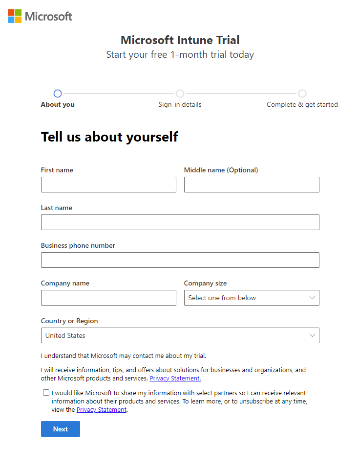
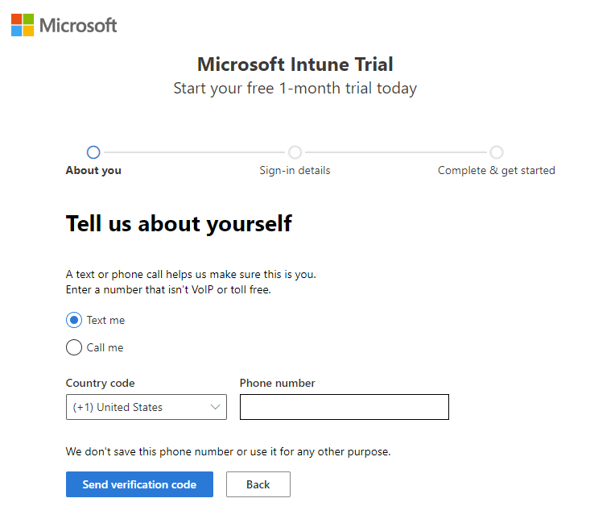
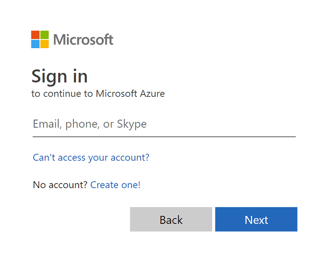

---
# required metadata

title: Try Microsoft Intune for free
titleSuffix: 
description: Understand how to create a free trial subscription, understand supported configurations and networking requirements, and optionally configure your domain name.
keywords:
author: Erikre
ms.author: erikre
manager: dougeby
ms.date: 11/22/2022
ms.topic: conceptual
ms.service: microsoft-intune
ms.subservice: fundamentals
ms.localizationpriority: high

# optional metadata

#ROBOTS:
#audience:

ms.reviewer:
ms.suite: ems
search.appverid: MET150
#ms.tgt_pltfrm:
ms.custom: intune-azure
ms.collection: 
  - M365-identity-device-management
  - highpri
---

# Try Microsoft Intune for free

Microsoft Intune helps you protect your workforce's corporate data by managing devices and apps. By following the steps in this topic, you'll create a free subscription to setup Microsoft Intune in a test environment.

Intune, which is a part of [Microsoft Endpoint Manager](/training/paths/endpoint-manager-fundamentals/), provides the cloud infrastructure, the cloud-based mobile device management (MDM), the cloud-based mobile application management (MAM), and the cloud-based PC management for your organization. It lets you protect your organization by controlling features and settings on Android, Android Enterprise, iOS/iPadOS, macOS, and Windows 10/11 devices. It integrates closely with Azure Active Directory (Azure AD) for identity and access control and also Azure Information Protection to help protect your organization's data. If you have on-premises infrastructure, such as Exchange or an Active Directory, you can use Intune connectors to help you connect to external services. Intune is included in Microsoft's [Enterprise Mobility + Security (EMS) suite](https://www.microsoft.com/microsoft-365/enterprise-mobility-security?azure-portal=true).

When you complete the sign up process, you'll have a new tenant. A tenant is a dedicated instance of Azure Active Directory (Azure AD) where your subscription to Intune is hosted. You can then configure the tenant, add users and groups, and assign licenses to users. When you're ready, you can help users enroll their devices and add apps that they need to begin the modern endpoint management process. As you continue, you can set configuration and protection policies, as well as other endpoint management capabilities.

## Prerequisites
Before setting up Microsoft Intune, review the following requirements:

- [Supported operating systems and browsers](supported-devices-browsers.md)
- [Network configuration requirements and bandwidth](network-bandwidth-use.md)

## Sign up for a Microsoft Intune free trial

When you sign up for the Intune free trial, you create a new Intune trial subscription using your work or school account. The trial subscription last 30 days. If you choose, you can convert the trial subscription to a full subscription based on your choice of product licenses. If you already are using your work or school account for a Microsoft service, you can **sign in** with that account and add Intune to your subscription. If you're uncertain whether you have an existing account, you can follow the Intune free trial sign-up steps below to check whether you need to create a new account for Intune.

>[!IMPORTANT]
>You can't combine an existing work or school account after you sign up for a new account.

To sign up for the Microsoft Intune free trial, follow the steps below:

1. Navigate to the [Intune set up account page](https://admin.microsoft.com/Signup/Signup.aspx?azure-portal=true&OfferId=40BE278A-DFD1-470a-9EF7-9F2596EA7FF9&dl=INTUNE_A&ali=1#0%20).

2. Enter your email address and click **Next**.

   > [!NOTE]
   > If you already have an account set up with another Microsoft service using your email address, you can choose to sign in to use the account with the Intune trial, or you can create a new account. These steps assume you are creating a new account.

   

3. Click **Set up account** to create a new account.

   

4. Add your name, phone number, company name, company size, and region. Then, click **Next**.

      

5. Click **Send Verification Code** to verify the phone number you added.

      

6. Enter the verification code you receive on your mobile device, then click **Verify**.

      

7. Add a domain name for your trial that represents your business or organization. Your name will be added before *.onmicrosoft.com*. Click **Check availability** > **Next**. If you like, you can later change this domain name to your custom domain name.

      

8. Add your user name and password that you'll use to log in to Microsoft Intune. Review the trial agreement and privacy statement. Click **Sign up** to create your account.

    > [!IMPORTANT]
    > Be sure to make a note of your user name and password.

      

9. After your account has been created, you'll see your user name. You'll use this user name to log in to Intune. Additionally, you receive an email message that contains your account information at the email address that you provided during the sign-up process. This email confirms your subscription is active.

### Sign in to Intune

Once you have signed up for Intune, you can use any device with a [supported browser](/mem/intune/fundamentals/supported-devices-browsers?azure-portal=true#intune-supported-web-browsers) to sign in to the [Microsoft Endpoint Manager admin center](https://go.microsoft.com/fwlink/??zure-portal=true&linkid=2109431) to administer the Intune service.

> [!NOTE]
> Microsoft Intune is a part of Microsoft Endpoint Manager. Microsoft Endpoint Manager is the overall management platform for managing, protecting, and monitoring all of your organization's endpoints.

If you're not already signed in to the portal, complete the following steps:

1. Open a new browser window and enter **[https://endpoint.microsoft.com](https://endpoint.microsoft.com)** in the address bar.
2. Use the user ID that you were given in the steps above to sign in. The user ID will look similar to the following: *yourID@yourdomain.onmicrosoft.com*.

    

When you sign up for a trial, you will also receive an email message that contains your account information and the email address that you provided during the sign-up process. This email confirms your trial is active.

> [!TIP]
> When working with the Microsoft Endpoint Manager, you may have better results working with a browser in regular mode, rather than private mode.

### View Intune free trial details

To view the Intune product details for your free trial, use the following steps:

1. Sign in to the [Microsoft 365 admin center](https://go.microsoft.com/fwlink/p/?LinkId=698854).
2. Select **Home** > **Subscription** > **Your products** > **Products** > **Microsoft Intune Trial**.

The **Microsoft Intune Trial** pane provides license, subscription, and product details.

## Confirm your tenant's MDM authority

To confirm that your MDM authority is set to Intune, use the following steps:

1. In the [Microsoft Endpoint Manager admin center](https://go.microsoft.com/fwlink/?linkid=2109431), select **Tenant administration** > **Tenant status**.
2. Under the **Tenant details** tab, find **MDM authority**.
3. Confirm your **MDM authority** is set to **Microsoft Intune**.

If after signing in to the Microsoft Endpoint Manager, you see an orange banner indicating that you haven't yet set the MDM authority, you can activate it at this time. The mobile device management (MDM) authority setting determines how you manage your devices. The MDM authority must be set before users can enroll devices for management.

### Set the MDM authority to Intune

1. If you do not have the MEM authority set, sign in to the [Microsoft Endpoint Manager admin center](https://endpoint.microsoft.com). 
2. Select the orange banner to open the **Mobile Device Management Authority** setting. The orange banner is only displayed if you haven't yet set the MDM authority. 

    > [!NOTE]
    > If you have set the MDM Authority, you will see the MDM authority value on the **Tenant administration** pane. The orange banner is only displayed if you haven't yet set the MDM authority. 

     

3. If your MDM Authority is not set, under **Choose MDM Authority**, set your MDM authority to **Intune MDM Authority**.

For more information about the MDM authority, see [Set the mobile device management authority](mdm-authority-set.md).

## Understand your Intune tenant domain name

When your organization signs up for Microsoft Intune, you're given an initial domain name hosted in Azure Active Directory (Azure AD) that looks like **your-domain.onmicrosoft.com**. In this example, **your-domain** is the domain name that you chose when you signed up. **onmicrosoft.com** is the suffix assigned to all accounts added to subscriptions. You can optionally configure your organization's custom domain to access Intune, instead of the domain name provided with your subscription.

> [!NOTE]
> Setting up a custom domain name is **optional**. If you are simply evaluating Intune using the free trial, you can skip the steps in this section.

Azure AD is the underlying infrastructure that supports identity management for all Microsoft cloud services. Azure AD stores information about license assignment states for users. Your subscription to Intune is hosted by an [Azure AD tenant](/previous-versions/azure/azure-services/jj573650(v=azure.100)). The tenant represents your organization. It's a dedicated instance of Azure AD that your organization receives at the beginning of a relationship with Microsoft. It's in this Azure AD tenant that you register and manage your end user's devices and apps.

Before you create user accounts or synchronize your on-premises Active Directory (for those using Endpoint Configuration Manager), we strongly recommend that you decide whether to use only the *.onmicrosoft.com* domain or to add one or more of your custom domain names. Set up a custom domain before adding users will help to simplify user management. Setting up a custom domain lets users sign in with the credentials they use to access your organization's other domain resources.

> [!TIP]
> To learn more about custom domains, see [Managing custom domain names in your Azure Active Directory](/azure/active-directory/enterprise-users/domains-manage?azure-portal=true).

You would not rename or remove the initial *onmicrosoft.com* domain name. However, you can add, verify, or remove a custom domain name used with Intune to keep your business identity clear. You must have access to your own custom domain name in order to add it to your Intune tenant.

### Add and verify your custom domain (OPTIONAL)

1. Go to [Microsoft 365 admin center](https://admin.microsoft.com/?azure-portal=true) and sign into your administrator account.
2. In the navigation pane, choose **Setup** > **Get your custom domain set up** > **Get started**.

    > [!TIP]
    > In this step, you'll see a provided video. Viewing this video will also show you how to add your domain.

3. Add your domain name and then click **Use this domain**.

    

    If you are using a common domain registrar like GoDaddy or WordPress, verifying your domain is a quick process. In this case, you'll see a 'sign in' option to verify your domain.

    The **Verify domain** dialog box opens, giving you the values to create the TXT record in your DNS hosting provider.
    - **GoDaddy users**: Microsoft 365 admin center redirects you to GoDaddy's login page. After you enter your credentials and accept the domain change permission agreement, the TXT record is created automatically. You can alternatively [create the TXT record](https://support.office.com/article/Create-DNS-records-at-GoDaddy-for-Office-365-f40a9185-b6d5-4a80-bb31-aa3bb0cab48a?azure-portal=true).
    - **Register.com users**: Follow the [step-by-step instructions](https://support.office.com/article/Create-DNS-records-at-Register-com-for-Office-365-55bd8c38-3316-48ae-a368-4959b2c1684e#BKMK_verify?azure-portal=true) to create the TXT record.

4. If you see the options to add a TXT record, add an MX record, or add a text file to the domain's website, you'll need to choose how you want to verify your domain. 

   

   The steps to add and verify a custom domain can also be [performed in Azure Active Directory](/azure/active-directory/fundamentals/add-custom-domain?azure-portal=true).

## Confirm your licenses

A Microsoft Intune license is created for you when you sign up for the Intune free trial. As part of this trial, you'll also have a trial Enterprise Mobility + Security (EMS) subscription. An Enterprise Mobility + Security (EMS) subscription includes both Azure Active Directory Premium and Microsoft Intune.

To confirm your Azure Active Directory Premium and Microsoft Intune, see [Confirm your licenses](../fundamentals/licenses.md#confirm-your-licenses).

## Admin experiences

There are two portals that you will use most often:
- The Microsoft Endpoint Manager admin center ([https://endpoint.microsoft.com/](https://endpoint.microsoft.com/)) is where you can explore the [capabilities of Intune](what-is-intune.md). This is where an admin would work with Intune.
- The Microsoft 365 admin center ([https://admin.microsoft.com](https://admin.microsoft.com)) is where you can add and manage users, if you are not using Azure Active Directory for this. You can also manage other aspects of your account, including billing and support.

## Next steps

In this topic, you've created a free subscription to try Intune in a test environment. For more information about setting up Intune, see [Set up Intune](setup-steps.md).

