---
# required metadata

title: Tutorial - Walkthrough the Microsoft Intune admin center
titleSuffix: Microsoft Intune
description: In this tutorial, you will tour Microsoft Intune in the Microsoft Intune admin center to better understand how to accomplish tasks.
keywords:
author: Erikre
ms.author: erikre
manager: dougeby
ms.date: 02/02/2023
ms.topic: tutorial
ms.service: microsoft-intune
ms.subservice: fundamentals
ms.localizationpriority: high
Customer intent: As an Intune admin, I want to learn where to find the different features in Intune from the Microsoft Intune admin center.

# optional metadata

#ROBOTS:
#audience:

ms.reviewer:
ms.suite: ems
#ms.tgt_pltfrm:
ms.custom: intune-azure
ms.collection:
- tier1
- M365-identity-device-management
- highpri
---

# Tutorial: Walkthrough Microsoft Intune admin center

Microsoft Intune provides the cloud infrastructure, the cloud-based mobile device management (MDM), cloud-based mobile application management (MAM), and cloud-based PC management for your organization. Intune helps you ensure that your company's devices, apps, and data meet your company's security requirements. You have the control to set which requirements need to be checked and what happens when those requirements aren't met. The [Microsoft Intune admin center](https://go.microsoft.com/fwlink/?linkid=2109431) is where you can find the Microsoft Intune service, as well as other device management related settings. Understanding the features available in Intune will help you accomplish various Mobile Device Management (MDM) and Mobile Application Management (MAM) tasks.

> [!NOTE]
> Microsoft Intune is a single, integrated endpoint management platform for managing all your endpoints. The Microsoft Intune admin center integrates Microsoft Configuration Manager and Microsoft Intune.
>>>>>>> b6a35210265f377bc91f5d32f67510e4864bd671

In this tutorial, you will:
> [!div class="checklist"]
> * Tour the Microsoft Intune admin center
> * Customize your view of the Microsoft Intune admin center

If you don't have an Intune subscription, [sign up for a free trial account](free-trial-sign-up.md).

## Prerequisites
Before setting up Microsoft Intune, review the following requirements:

- [Supported operating systems and browsers](supported-devices-browsers.md)
- [Network configuration requirements and bandwidth](network-bandwidth-use.md)

## Sign up for a Microsoft Intune free trial

Trying out Intune is free for 30 days. If you already have a work or school account, **sign in** with that account and add Intune to your subscription. Otherwise, you can [sign up for a free trial account](free-trial-sign-up.md) to use Intune for your organization.

> [!IMPORTANT]
> You can't combine an existing work or school account after you sign up for a new account.

## Tour Microsoft Intune in the Microsoft Intune admin center

Follow the steps below to better understand Intune in the Microsoft Intune admin center. Once you complete the tour, you'll have a better understanding of some of the major areas of Intune.

1. Open a browser and sign in to the [Microsoft Intune admin center](https://go.microsoft.com/fwlink/?linkid=2109431). If you are new to Intune, use your free trial subscription.

    

    When you open the Microsoft Intune admin center, the service is displayed in a pane of your browser. Some of the first workloads you may use in Intune include **Devices**, **Apps**, **Users**, and **Groups**. A workload is simply a sub-area of a service. When you select the workload, it opens that pane as a full page. Other panes slide out from the right side of the pane when they open, and close to reveal the previous pane. 

    By default, when you open the Microsoft Intune admin center, you'll see the **Home page** pane. This pane provides an overall visual snapshot of tenant status and compliance status, as well as other helpful related links.

2. From the navigation pane, select **Dashboard** to display overall details about the devices and client apps in your Intune tenant. If you are starting with a new Intune tenant, you will not have any enrolled devices yet. 

    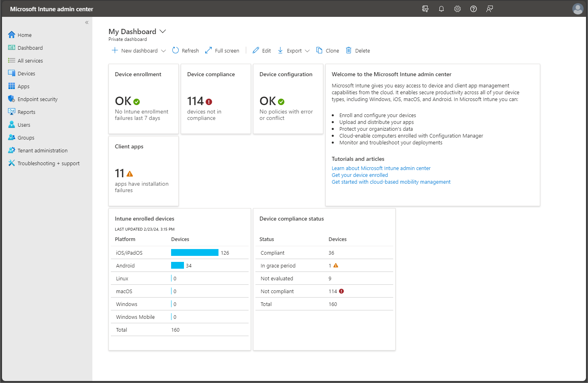
    
    Intune lets you manage your workforce's devices and apps, including how they access your company data. To use this mobile device management (MDM) service, the devices must first be enrolled in Intune. When a device is enrolled, it is issued an MDM certificate. This certificate is used to communicate with the Intune service. 

    There are several methods to enroll your workforce's devices into Intune. Each method depends on the device's ownership (personal or corporate), device type (iOS/iPadOS, Windows, Android), and management requirements (resets, affinity, locking). However, before you can enable device enrollment, you must set up your Intune infrastructure. In particular, device enrollment requires that you [set your MDM authority](mdm-authority-set.md). For more information about getting your Intune environment (tenant) ready, see [Set up Intune](deployment-plan-setup.md). Once you have your Intune tenant ready, you can enroll devices. For more information about device enrollment, see [What is device enrollment?](/mem/intune/fundamentals/deployment-guide-enrollment)

3. From the navigation pane, select **Devices** to display details about the enrolled devices in your Intune tenant. 

    > [!TIP]
    > If you have previously used Intune in the Azure portal, you found the above details in the Azure portal by signing in to [Intune](https://go.microsoft.com/fwlink/?linkid=2090973) and selecting **Devices**.

    The **Devices - Overview** pane has several tabs that allow you to view a summary of the following statuses and alerts:
    - **Enrollment status** - Review details about Intune enrolled devices by platform and enrollment failures.
    - **Enrollment alerts** - Find more details about unassigned devices by platform. 
    - **Compliance status** - Review compliance status based on device, policy, setting, threats, and protection. Additionally, this pane provides a list of devices without a compliance policy.
    - **Configuration status** - Review configuration status of device profiles, as well as profile deployment., and 
    - **Software update status** - See a visual of the deployment status for all devices and for all users.

    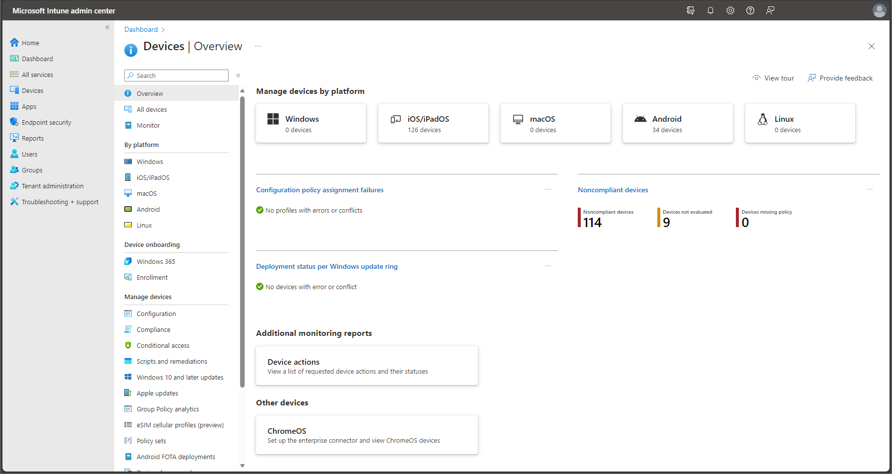

4. From the **Devices - Overview** pane, select **Compliance policies** to display details about compliance for devices managed by Intune. You will see details similar to the following image.

    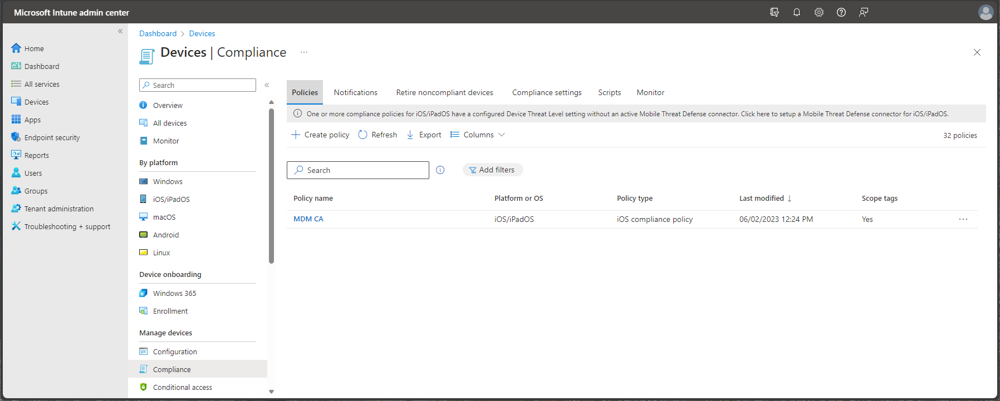
    
    > [!TIP]
    > If you have previously used Intune in the Azure portal, you found the above details in the Azure portal by signing in to [Intune](https://go.microsoft.com/fwlink/?linkid=2090973) and selecting **Device Compliance**.

    Compliance requirements are essentially rules, such as requiring a device PIN, or requiring device encryption. Device compliance policies define the rules and settings that a device must follow to be considered compliant. To use device compliance, you must have:
    - An Intune and an Azure Active Directory (Azure AD) Premium subscription
    - Devices running a supported platform
    - Devices must be enrolled in Intune
    - Devices that are enrolled to either one user or no primary user.
    
    For more information, see [Get started with device compliance policies in Intune](../protect/device-compliance-get-started.md).

5. From the **Devices - Overview** pane, select **Conditional Access** to display details about access policies.

    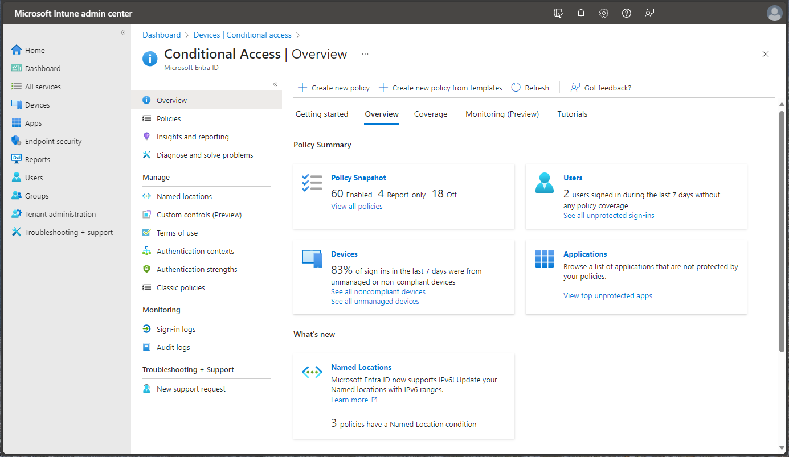

    > [!TIP]
    > If you have previously used Intune in the Azure portal, you found the above details in the Azure portal by signing in to [Intune](https://go.microsoft.com/fwlink/?linkid=2090973) and selecting **Conditional Access**.

    Conditional Access refers to ways you can control the devices and apps that are allowed to connect to your email and company resources. To learn about device-based and app-based Conditional Access, and find common scenarios for using Conditional Access with Intune, see [What's Conditional Access?](../protect/conditional-access.md)

6. From the navigation pane, select **Devices** > **Configuration profiles** to display details about device profiles in Intune.

    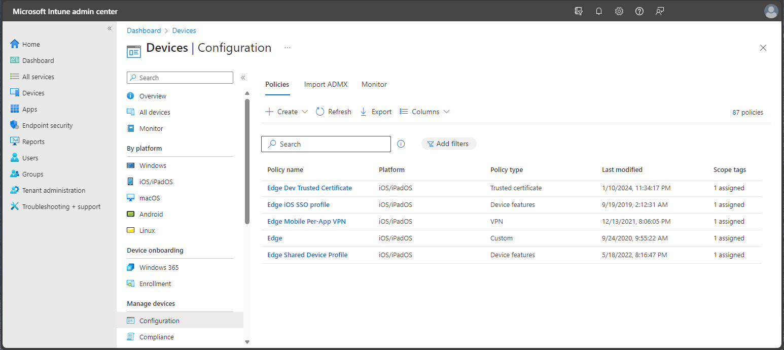
    
    > [!TIP]
    > If you have previously used Intune in the Azure portal, you found the above details in the Azure portal by signing in to [Intune](https://go.microsoft.com/fwlink/?linkid=2090973) and selecting **Device configuration**.

    Intune includes settings and features that you can enable or disable on different devices within your organization. These settings and features are added to "configuration profiles". You can create profiles for different devices and different platforms, including iOS/iPadOS, Android, macOS, and Windows. Then, you can use Intune to apply the profile to devices in your organization.   

    For more information about device configuration, see [Apply features settings on your devices using device profiles in Microsoft Intune](../configuration/device-profiles.md).

7. From the navigation pane, select **Devices** > **All devices** to display details about your Intune tenant's enrolled devices. If you are starting with a new Intune enlistment, you will not have any enrolled devices yet.

    

    This list of devices show key details about compliance, OS version, and last check-in date.

    > [!TIP]
    > If you have previously used Intune in the Azure portal, you found the above details in the Azure portal by signing in to [Intune](https://go.microsoft.com/fwlink/?linkid=2090973) and selecting **Devices** > **All devices**.
 
8. From the navigation pane, select **Apps** to display an overview of app status. This pane provides app installation status based on the following tabs:

    > [!TIP]
    > If you have previously used Intune in the Azure portal, you found the above details in the Azure portal by signing in to [Intune](https://go.microsoft.com/fwlink/?linkid=2090973) and selecting **Client apps**.

    The **Apps - Overview** pane has two tabs that allow you to view a summary of the following statuses:
    - **Installation status** - View the top installation failures by device, as well as the apps with installation failures.  
    - **App protection policy status** - Find details about assigned users to app protection policies, as well as flagged users.

    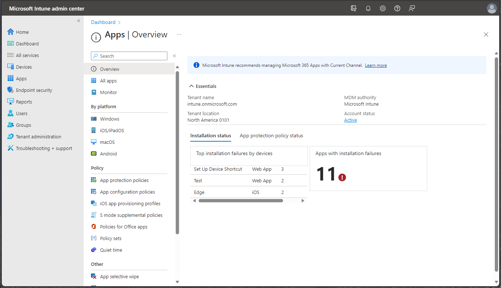

    As an IT admin, you can use Microsoft Intune to manage the client apps that your company's workforce uses. This functionality is in addition to managing devices and protecting data. One of an admin's priorities is to ensure that end users have access to the apps they need to do their work. Additionally, you might want to assign and manage apps on devices that are not enrolled with Intune. Intune offers a range of capabilities to help you get the apps you need on the devices you want. 

    > [!NOTE]
    > The **Apps - Overview** pane also provides tenant status and account details.

    For more information about adding and assigning apps, see [Add apps to Microsoft Intune](../apps/apps-add.md) and [Assign apps to groups with Microsoft Intune](../apps/apps-deploy.md).

9. From the **Apps - Overview** pane, select **All apps** to see a list of apps that have been added to Intune.

    > [!TIP]
    > If you have previously used Intune in the Azure portal, you found the above details in the Azure portal by signing in to [Intune](https://go.microsoft.com/fwlink/?linkid=2090973) and selecting **Client apps** > **Apps**.

    You can add a variety of different app type based on platform to Intune. Once an app has been added, you can assign it to groups of users. 

    

    For more information, see [Add apps to Microsoft Intune](../apps/apps-add.md).

10. From the navigation pane, select **Users** to display details about the users that you have included in Intune. These users are your company's workforce.

    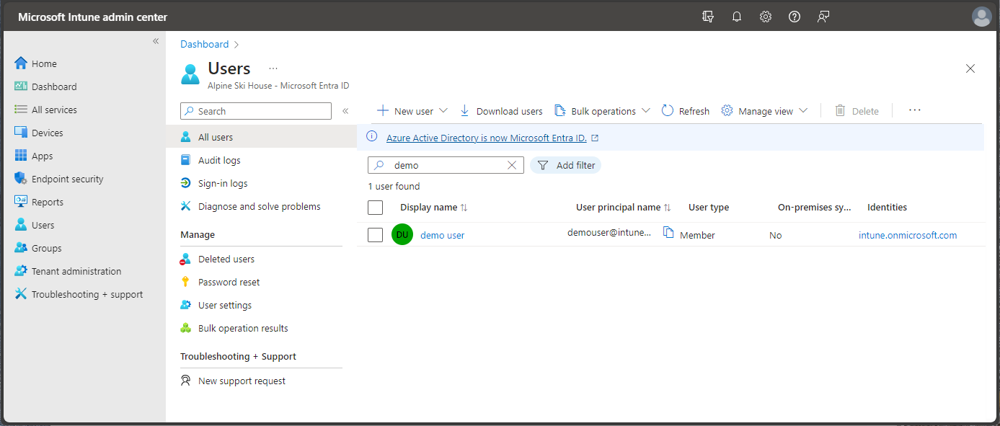

    > [!TIP]
    > If you have previously used Intune in the Azure portal, you found the above details in the Azure portal by signing in to [Intune](https://go.microsoft.com/fwlink/?linkid=2090973) and selecting **Users**.

    You can add users directly to Intune or synchronize users from your on-premises Active Directory. Once added, users can enroll devices and access company resources. You can also give users additional permissions to access Intune. For more information, see [Add users and grant administrative permission to Intune](users-add.md).

11. From the navigation pane, select **Groups** to display details about the Azure Active Directory (Azure AD) groups included in Intune. As an Intune admin, you use groups to manage devices and users.

    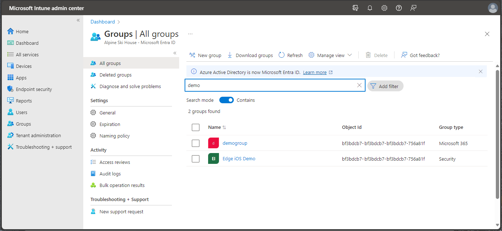

    > [!TIP]
    > If you have previously used Intune in the Azure portal, you found the above details in the Azure portal by signing in to [Intune](https://go.microsoft.com/fwlink/?linkid=2090973) and selecting **Groups**.

    You can set up groups to suit your organizational needs. Create groups to organize users or devices by geographic location, department, or hardware characteristics. Use groups to manage tasks at scale. For example, you can set policies for many users or deploy apps to a set of devices. For more information about groups, see [Add groups to organize users and devices](groups-add.md).

12. From the navigation pane, select **Tenant administration** to display details about your Intune tenant.

    > [!TIP]
    > If you have previously used Intune in the Azure portal, you found the above details in the Azure portal by signing in to [Intune](https://go.microsoft.com/fwlink/?linkid=2090973) and selecting **Tenant status**.

    The **Tenant admin - Tenant status** pane provides tabs for **Tenant details**, **Connector status**, and **Service health dashboard**. If there are any issues with your tenant or Intune itself, you will find details available from this pane.

    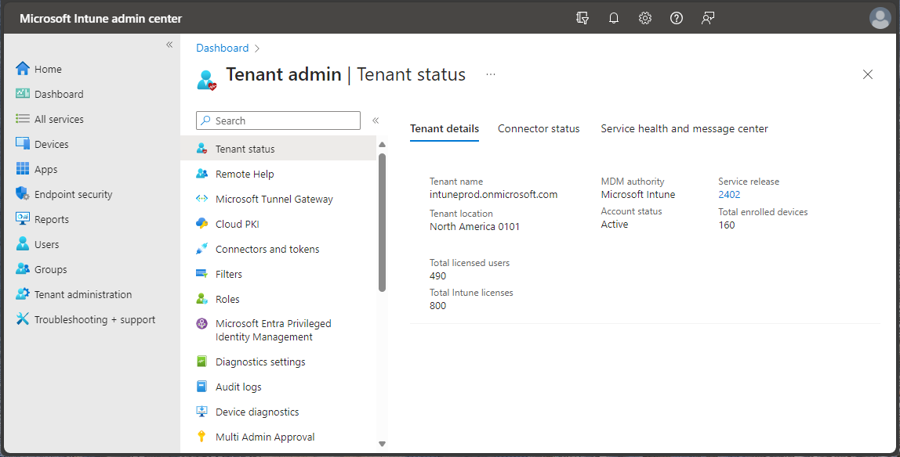

    For more information, see [Intune Tenant Status](tenant-status.md).

13. From the navigation pane, select **Troubleshooting + support** > **Troubleshoot** to check status details on a specific user. 

    > [!TIP]
    > If you have previously used Intune in the Azure portal, you found the above details in the Azure portal by signing in to [Intune](https://go.microsoft.com/fwlink/?linkid=2090973) and selecting **Troubleshoot**.

    From the **Assignments** dropdown list, you can choose to view the targeted assignments of client apps, policies, update rings, and enrollment restrictions. Additionally, this pane provides device details, app protection status, and enrollment failures for a specific user.

    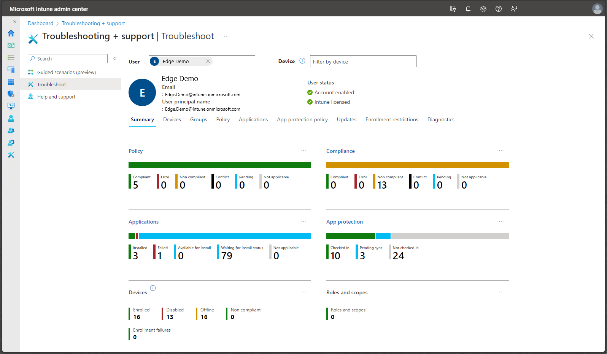

    For more information about troubleshooting within Intune, see [Use the troubleshooting portal to help users at your company](help-desk-operators.md).

14. From the navigation pane, select **Troubleshooting + support** > **Help and support** to request help.

    > [!TIP]
    > If you have previously used Intune in the Azure portal, you found the above details in the Azure portal by signing in to [Intune](https://go.microsoft.com/fwlink/?linkid=2090973) and selecting **Help and support**.

    As an IT admin, you can use the **Help and Support** option to search and view solutions, as well as file an on-line support ticket for Intune.

    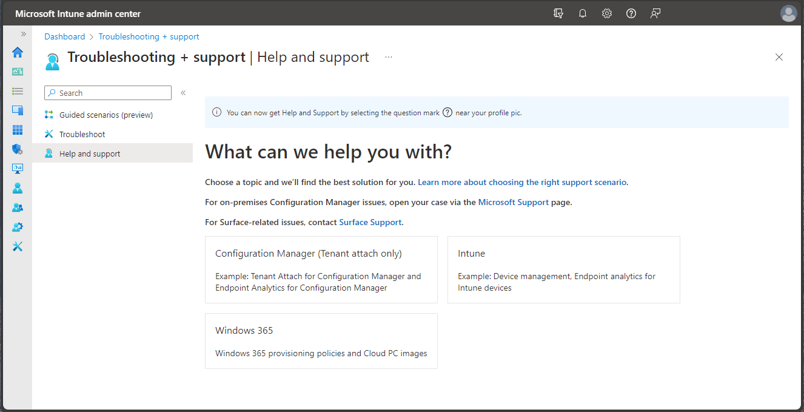

    To create a support ticket, your account must be assigned as an administrator role in Azure Active Directory. Administrator roles include, **Intune administrator**, **Global administrator**, and **Service administrator**.

    For more information, see [How to get support in Microsoft Intune](../../get-support.md).

15. From the navigation pane, select **Troubleshooting + support** > **Guided scenarios** to display available Intune guided scenarios.

    A guided scenario is a customized series of steps centered around one end-to-end use-case. Common scenarios are based on the role an admin, user, or device plays in your organization. These roles typically require a collection of carefully orchestrated profiles, settings, applications, and security controls to provide the best user experience and security.

    If you are not familiar with all the steps and resources needed to implement a particular Intune scenario, guided scenarios may be used as your starting point.

    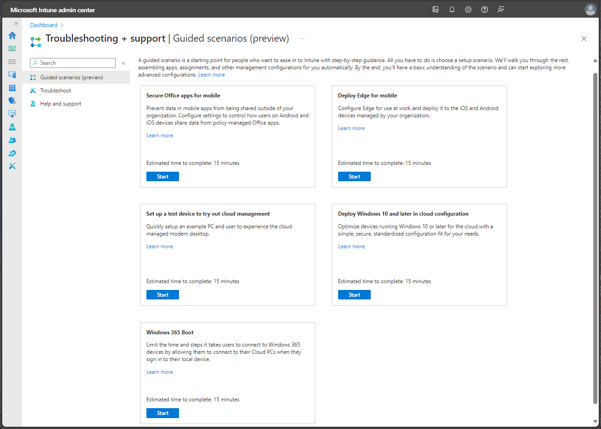

    For more information about guided scenarios, see [Guided scenarios overview](guided-scenarios-overview.md).

## Configure the Microsoft Intune admin center

Microsoft Intune admin center allows you to customize and configure the view of the portal.

### Change the Dashboard

The **Dashboard** to display overall details about the devices and client apps in your Intune tenant. Dashboards provide a way for you to create a focused and organized view in the Microsoft Intune admin center. Use dashboards as a workspace where you can quickly launch tasks for day-to-day operations and monitor resources. Build custom dashboards based on projects, tasks, or user roles, for example. The Microsoft Intune admin center provides a default dashboard as a starting point. You can edit the default dashboard, create and customize additional dashboards, and publish and share dashboards to make them available to other users. 

   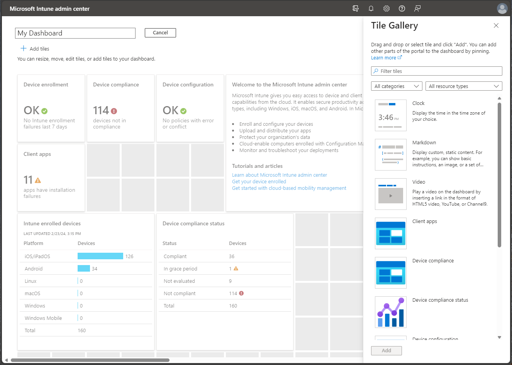

To modify your current dashboard, select **Edit**. If you don't want to change your default dashboard, you can also create a **New dashboard**. Creating a new dashboard gives you an empty, private dashboard with the **Tile Gallery**, which lets you add or rearrange tiles. You can find tiles by category or resource type. You can also search for particular tiles. Select **My Dashboard** to select any of your existing custom dashboards.

### Change the Portal settings

You can customize the Microsoft Intune admin center by choosing the default view, the theme, the credentials timeout period, as well as language and region settings.

   

## Next steps

To get running quickly on Microsoft Intune, step through the Intune Quickstarts by first setting up a free Intune account.

> [!div class="nextstepaction"]
> [Quickstart: Try Microsoft Intune for free](free-trial-sign-up.md)
