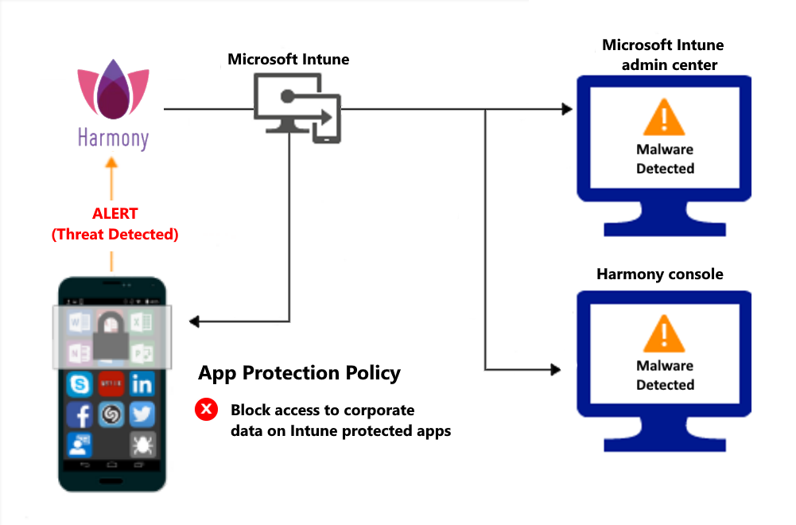

---
# required metadata

title: Set up Check Point Harmony Mobile MTD connector with Intune
titleSuffix: Microsoft Intune
description: Learn about integrating Intune with Check Point Harmony Mobile Threat Defense to control mobile device access to your corporate resources.
keywords:
author: brenduns
ms.author: brenduns
manager: dougeby
ms.date: 04/19/2022
ms.topic: how-to
ms.service: microsoft-intune
ms.subservice: protect
ms.localizationpriority: high
ms.technology:
ms.assetid: 706a4228-9bdf-41e0-b8d1-64c923dd2d2b

# optional metadata

#ROBOTS:
#audience:
#ms.devlang:
ms.reviewer: aanavath
ms.suite: ems
search.appverid: MET150
#ms.tgt_pltfrm:
ms.custom: intune-azure; seodec18
ms.collection: M365-identity-device-management
---

# Check Point Harmony Mobile Threat Defense connector with Intune

You can control mobile device access to corporate resources using Conditional Access based on risk assessment conducted by Check Point Harmony Mobile, a mobile threat defense solution that integrates with Microsoft Intune. Risk is assessed based on telemetry collected from devices running the Harmony Mobile Protect app.

You can configure Conditional Access policies based on Check Point Harmony Mobile risk assessment enabled through Intune device compliance policies, which you can use to allow or block noncompliant devices to access corporate resources based on detected threats.

> [!NOTE]
> This Mobile Threat Defense vendor is not supported for unenrolled devices.

## Supported platforms

- **Android 8 and later**

- **iOS 12 and later**

## Pre-requisites

- Azure Active Directory Premium

- Microsoft Intune subscription

- Check Point Harmony Mobile Threat Defense subscription
  - See the [CheckPoint Harmony website](https://www.checkpoint.com/harmony).

## How do Intune and Check Point Harmony Mobile help protect your company resources?

Check Point Harmony Mobile app for Android and iOS/iPadOS captures file system, network stack, device and application telemetry where available, then sends the telemetry data to the Check Point Harmony cloud service to assess the device's risk for mobile threats.

The Intune device compliance policy includes a rule for Check Point Harmony Mobile Threat Defense, which is based on the Check Point Harmony risk assessment. When this rule is enabled, Intune evaluates device compliance with the policy that you enabled. If the device is found noncompliant, users are blocked access to corporate resources like Exchange Online and SharePoint Online. Users also receive guidance from the Harmony Mobile Protect app installed in their devices to resolve the issue and regain access to corporate resources.

Here are some common scenarios:

### Control access based on threats from malicious apps

When malicious apps such as malware are detected on devices, you can block devices until the threat is resolved:

- Connecting to corporate e-mail

- Syncing corporate files with the OneDrive for Work app

- Accessing company apps

*Block when malicious apps are detected:*

> [!div class="mx-imgBorder"]
> 

*Access granted on remediation:*

> [!div class="mx-imgBorder"]
> 

### Control access based on threat to network

Detect threats like **Man-in-the-middle** in network, and protect access to Wi-Fi networks based on the device risk.

*Block network access through Wi-Fi:*

> [!div class="mx-imgBorder"]
> 

*Access granted on remediation:*

> [!div class="mx-imgBorder"]
> 

### Control access to SharePoint Online based on threat to network

Detect threats like **Man-in-the-middle** in network, and prevent synchronization of corporate files based on the device risk.

*Block SharePoint Online when network threats are detected:*

> [!div class="mx-imgBorder"]
> 

*Access granted on remediation:*

> [!div class="mx-imgBorder"]
> 

### Control access on unenrolled devices based on threats from malicious apps

When the Check Point Harmony Mobile Threat Defense solution considers a device to be infected:
> [!div class="mx-imgBorder"]
> 

Access is granted on remediation:

> [!div class="mx-imgBorder"]
> 

## Next steps

- [Integrate Check Point Harmony Mobile with Intune](checkpoint-sandblast-mobile-mtd-connector-integration.md)

- [Set up Harmony Mobile Protect app](mtd-apps-ios-app-configuration-policy-add-assign.md)

- [Create Check Point Harmony Mobile device compliance policy](mtd-device-compliance-policy-create.md)

- [Enable Check Point Harmony Mobile MTD connector](mtd-connector-enable.md)
