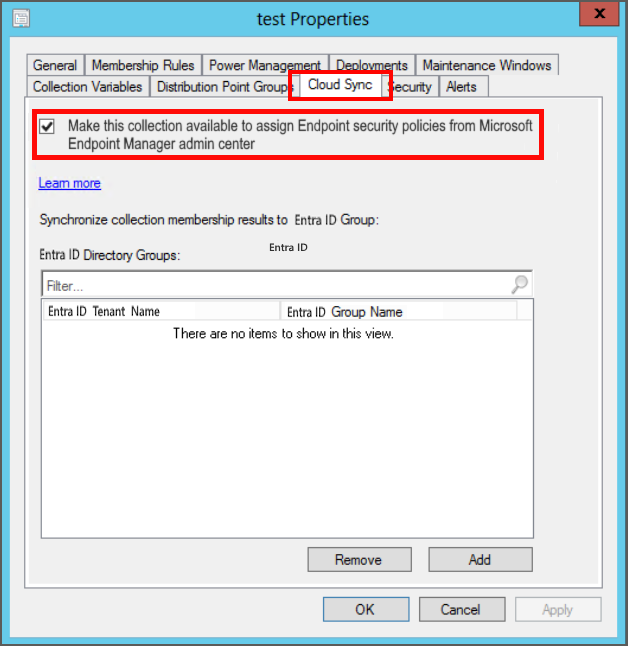

<!--Don't apply H2/H3 in this include file since they are context driven by article-->
1. From a Configuration Manager console connected to your top-level site, right-click on a device collection that you synchronize to Microsoft Intune admin center and select **Properties**.

2. On the **Cloud Sync** tab, enable the option to **Make this collection available to assign Endpoint security policies from Microsoft Endpoint Manager admin center**.

   - You can't select this option if your Configuration Manager hierarchy isn't tenant attached.
   - The collections available for this option are limited by the [collection scope selected for tenant attach upload](../../../configmgr/tenant-attach/device-sync-actions.md#bkmk_edit). <!--CM7423168-->
  
   

3. Select **Add** and then select the Azure Active Directory group that you would like to synchronize with **Collect membership results**.

4. Select **OK** to save the configuration.

   Devices in this collection can now onboard with Microsoft Defender for Endpoint, and support use of Intune endpoint security policies.
